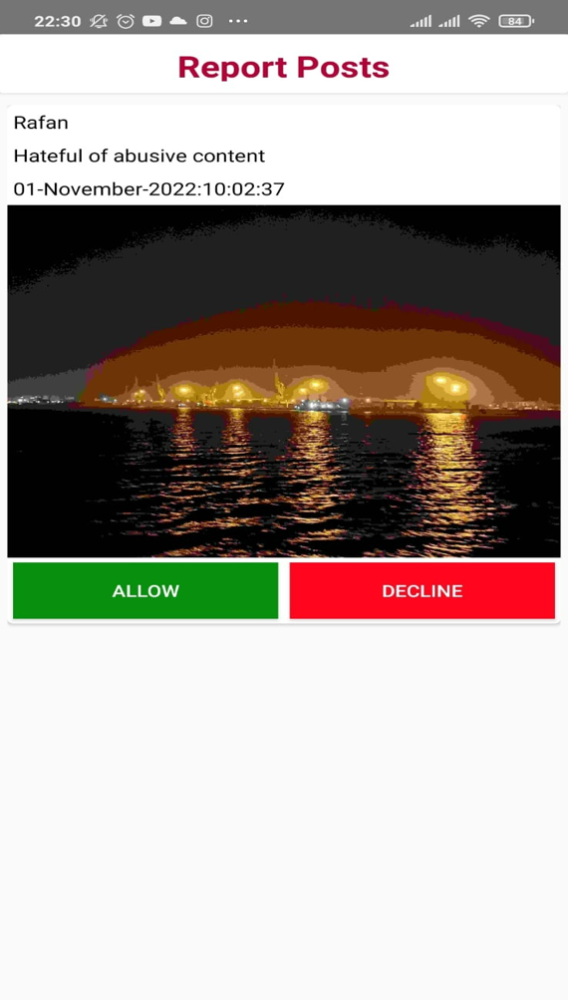

# WeLink
<h1>Introduction</h1>
<ul>
	<li>WeLink is an android based social media platform.</li>
	<li>Developed on Android Studio Dolphin | 2021.3.1</li>
	<li>Firebase BoM-30.4.1  is used as application database</li>
	<li>Jitsi meet API  for our video calling feature </li>
	<li>More than 40 social connectivity features </li>
</ul>
 

<h2>Use Case Diagram</h2>

 
Figure: Use Case Diagram

<h2>Basic Features</h2>
<ul>
	<li>SIGN UP</li>
	<li>SIGN IN</li>
	<li>USER AUTHENTICATION</li>
	<ul>
		<li>Provided by Firebase </li>
		<li>By checking authentic email and password</li>
	</ul>
	<li>SIGN OUT</li>
</ul>
 

<h2>Create Profile</h2>
<ul>
	<li>Create Profile with </li>
	<ul>
		<li>personal Information and</li>
		<li>profile picture</li>
	</ul>
	<li>Profile can be edited anytime</li>
</ul>

 

<h2>Profile Maintenance</h2>
<ul>
	<li>Profile may be private or public</li>
	<li>Public profiles can be viewed by other users </li>
	<li>Here is a Private profile</li>
</ul>

 

<h2>Market Place</h2>
<ul>
	<li>Upload product information for sale</li>
	<li>Communicate with the seller by sending message</li>
</ul>

 

<h2>Posting</h2>
<ul>
	<li>Upload and view post:</li>
	<ul>
		<li>Text</li>
		<li> photos </li>
		<li> videos </li>
	</ul>
	<li>Like on posts or comments</li>
	<li>Comment and reply </li>
</ul>

 

<h2>Options on Post</h2>
<ul>
	<li>Delete</li>
	<li>Edit Post</li>
	<li>Share</li>
	<li>Copy URL Link</li>
	<li>Download</li>
	<li>Report on a post</li>
</ul>

 

<h2>Find Friends & Send Follow Request</h2>
<ul>
	<li>Find users by their name</li>
	<li>View profile by clicking on “View Profile”</li>
	<li>Send Follow request </li>
	<li>Accept Follow request</li>
</ul>

 

<h2>Messaging</h2>
<ul>
	<li>Text message</li>
	<li>Photos</li>
	<li>Audio recorder and sending audio file</li>
	<li>Unsend message</li>
	<li>View details</li>
	<li>Download files</li>
	<li>Screenshot restriction</li>
</ul>

 

<h2>Video Call</h2>
<ul>
	<li>Outgoing video call</li>
	<li>Incoming Video call</li>
</ul>

<h2>Story</h2>
<ul>
	<li>Story is a temporary post</li>
	<li>It will automatically disappear after 24 hours</li>
	<li>User also can delete it any time</li>
</ul>

<h2>Additional Features</h2>
<ul>
	<li>Notifications</li>
	<li>View all followers</li>
	<li>View posts category wise</li>
	<li>Deleting Profile</li>
	<li>Block or Unblock an user</li>
	<li>Light and dark mode</li>
</ul>

<h2>Admin Panel</h2>
<ul>
	<li>Send notification message to all users</li>
	<li>Take action on reported posts</li>
	<li>Take action on reported user</li>
</ul>

